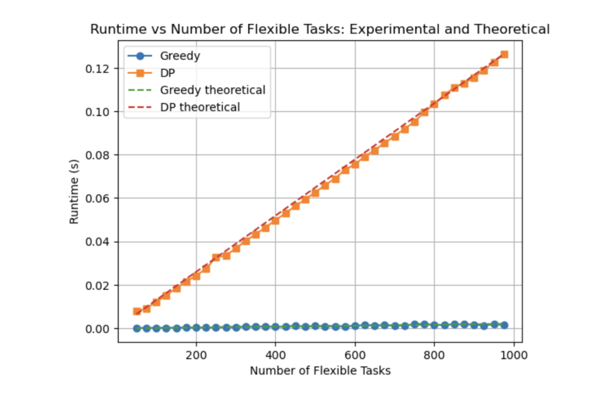
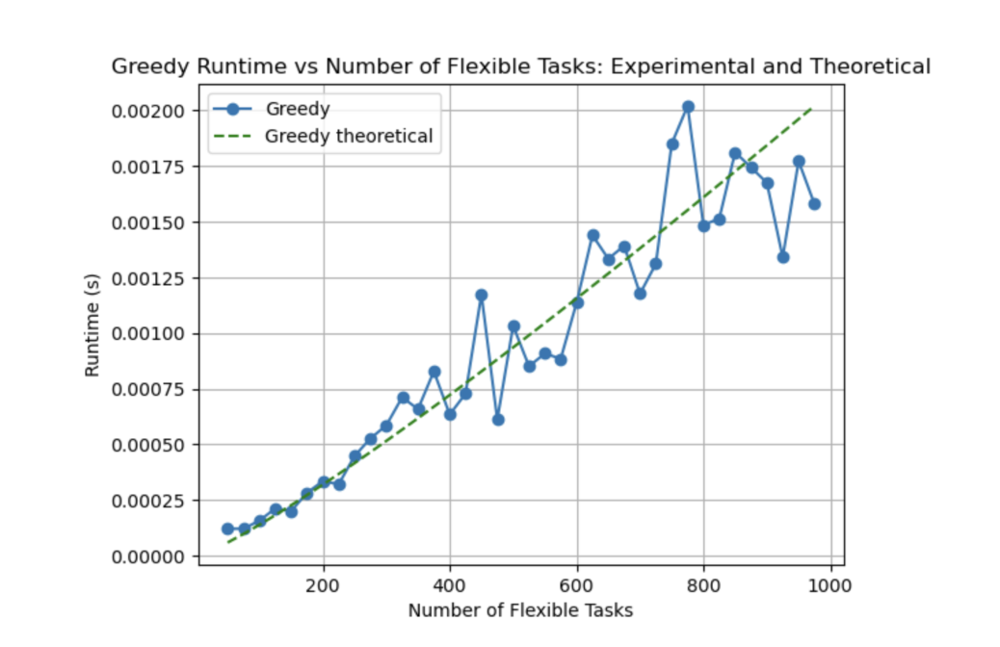
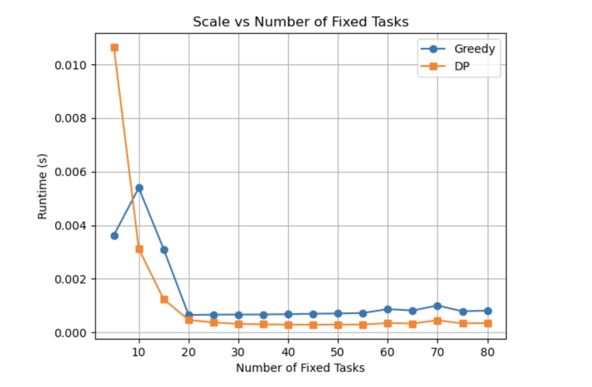
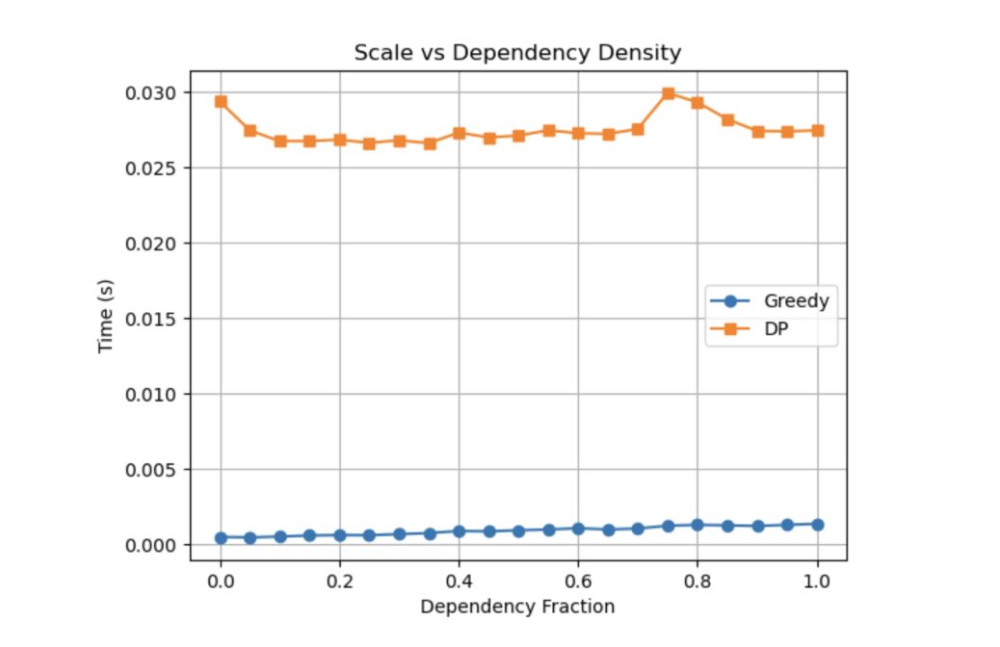

# Intelligent Task Scheduler: Greedy vs Dynamic Programming Optimization

A sophisticated task scheduling system that implements and compares two algorithmic approaches to optimize daily productivity through utility maximization.

## Overview

This project tackles the complex problem of optimal task scheduling by implementing both **greedy** and **dynamic programming** algorithms. The scheduler intelligently prioritizes tasks based on multiple factors including urgency, dependencies, duration, and task categories, making it ideal for students, professionals, and anyone seeking to optimize their daily routines.

## Key Features

### Multi-Factor Utility Calculation
- **Base Priority**: User-defined urgency levels (1-3 scale)
- **Dependency Bonus**: Higher priority for tasks that unlock fixed events
- **Duration Penalty**: Accounts for diminishing returns on longer tasks
- **Type Bonus**: Weights academic/career tasks higher than leisure activities

### Dual Algorithm Implementation
- **Greedy Scheduler**: O(n log n) complexity, fast and practically optimal
- **Dynamic Programming Scheduler**: O(nC) complexity, guarantees global optimality
- **Comprehensive Comparison**: Runtime analysis and performance benchmarking

### Advanced Scheduling Features
- Fixed-time event handling (classes, meetings, meals)
- Dependency management and validation
- Custom max heap implementation for priority queuing
- Conflict detection and resolution

## Algorithm Performance

### Greedy Approach
- **Time Complexity**: O(n log n)
- **Best For**: Large task sets, real-time scheduling needs
- **Strategy**: Selects highest-utility tasks first using max heap

### Dynamic Programming Approach
- **Time Complexity**: O(nC) where C is time window capacity
- **Best For**: Guaranteed optimal solutions in constrained windows
- **Strategy**: Solves 0-1 knapsack problem for each time window

## Results & Analysis

**When time is abundant**: Both algorithms achieve similar utility outcomes, with greedy being significantly faster.

**When time is constrained**: DP guarantees optimal task packing, while greedy may miss optimal combinations.

**Performance Benchmarks**


<p><em>Runtime vs Number of Flexible tasks: Experimental and Theoretical</em></p>


<p><em>Greedy. Runtime vs Number of Flexible tasks: Experimental and Theoretical</em></p>


<p><em>Runtime vs Number of Fixed tasks</em></p>


<p><em>Runtime vs Proportion of tasks with Dependencies rising</em></p>

## Usage Example

```python
# Define tasks with (description, duration, dependencies, start_time, priority, type)
tasks = [
    ("Study Session", 120, [], None, 3, "School & Career"),
    ("Gym Workout", 90, [], None, 2, "Sports & Health"),
    ("Team Meeting", 60, ["Prep Materials"], 14*60, 3, "School & Career"),
]

# Format and run algorithms
formatted_tasks = format_tasks(tasks)
dp_schedule, _ = core_scheduler(formatted_tasks, dp_fill)
greedy_schedule, _ = core_scheduler(formatted_tasks, greedy_fill)

# Display results
display_schedule(dp_schedule, "DYNAMIC PROGRAMMING", formatted_tasks, [])
display_schedule(greedy_schedule, "GREEDY", formatted_tasks, [])
```

## Installation & Setup

```bash
git clone https://github.com/yourusername/intelligent-task-scheduler
cd intelligent-task-scheduler
jupyter notebook scheduler.ipynb
```

**Requirements**: Python 3.7+, Jupyter Notebook, matplotlib, numpy

## Technical Highlights

- **Custom Data Structures**: Implemented max heap from scratch for educational purposes
- **Optimization Theory**: Practical application of knapsack problem to real-world scheduling
- **Empirical Analysis**: Systematic performance benchmarking validates theoretical predictions
- **Algorithm Design**: Clean separation of concerns between utility calculation, scheduling strategies, and display logic

## Future Extensions

- **Multitasking Integration**: Framework for parallel execution of compatible activities
- **Adaptive Learning**: Machine learning integration for personalized utility optimization
- **Real-time Updates**: Dynamic rescheduling based on task completion and disruptions

---

*This project bridges theoretical computer science with practical productivity optimization, showcasing algorithmic thinking applied to daily life improvement.*
